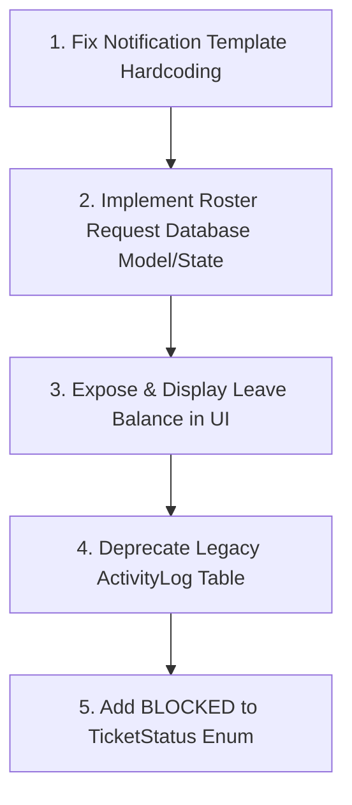

# Apex OS Operational Convergence Fix Plan

This document outlines the exact root causes, affected files, recommended fix order, and safest stabilization sequence to resolve the remaining gaps in Apex OS.

---

## 1. Root Cause & File Analysis

### Gap 1: Roster Request Persistence
* **Root Cause:** In `team/page.tsx`, the `requestedIds` set is stored entirely in React component local state (`useState`). No database record is created, and no query is made on mount to restore the requested state.
* **Affected Files:**
  * `frontend/app/(dashboard)/(operations)/team/page.tsx`
* **Disconnect:** Frontend-only local state represents a pending backend process that should be persisted.

### Gap 2: Notification Template Hardcoding
* **Root Cause:** In `TeamService.sendTeamRequest()`, the notification message template is hardcoded to output `to be added to the AI & R&D team` regardless of the requester's actual department.
* **Affected Files:**
  * `backend/src/modules/operations/team/team.service.ts`
* **Disconnect:** Requester's actual department relation exists in the database but is ignored in the notification service template.

### Gap 3: Parallel Redundant Event Logs
* **Root Cause:** Legacy `ActivityLog` entries and unified `OperationalEvent` records are logged simultaneously during comment creation, ticket creation, status changes, and updates.
* **Affected Files:**
  * `backend/src/modules/operations/comments/comments.service.ts`
  * `backend/src/modules/operations/tickets/tickets.service.ts`
* **Disconnect:** Two separate tables (`activity_logs` and `operational_events`) serve the same audit purpose, causing write redundancy.

### Gap 4: Missing Blocker Ticket Status
* **Root Cause:** The `TicketStatus` enum in the Prisma schema only contains `OPEN`, `IN_PROGRESS`, `REVIEW`, `DONE`, and `CLOSED`. There is no `BLOCKED` status or blocker entity relation.
* **Affected Files:**
  * `backend/prisma/schema.prisma`
  * `backend/src/modules/operations/tickets/tickets.service.ts`
* **Disconnect:** Event logger accepts `TICKET_BLOCKED` action, but the database cannot store this state on the ticket.

### Gap 5: Leave Balance Display
* **Root Cause:** The frontend `leave/page.tsx` renders request lists and applies leave using the balance check, but does not fetch or display the remaining leave balance banner to the employee.
* **Affected Files:**
  * `frontend/app/(dashboard)/(operations)/leave/page.tsx`
* **Disconnect:** `LeaveBalanceService` exists in the backend to calculate entitlements, but is not exposed to the user layout.

---

## 2. Recommended Fix Order & Sequence

To maintain absolute stability, fixes must be sequenced logically (dependencies first).

### Phase 1: Safe Low-Risk Fixes (No DB Migrations)
1. **Fix Notification Hardcoding:**
   - Query the requester's department in `team.service.ts` and replace the hardcoded string.
2. **Leave Balance Display:**
   - Fetch leave balance on frontend mount from `/api/leave/balance` (or equivalent endpoint) and display a card/banner: `"You have X annual leave days remaining."`

### Phase 2: Workflow Trust Fixes (Minor Schema Changes)
3. **Roster Request Persistence:**
   - Add a `TeamRequest` model or save requests to `localStorage` as a fallback, or leverage existing notifications to cache the requested state on mount.
4. **Deprecate Legacy ActivityLog Table:**
   - Audit and redirect all legacy `activityLog` queries to `operationalEvent`, then remove references to `prisma.activityLog` from comment and ticket services to eliminate write duplication.

### Phase 3: Structural Enhancements (Requires DB Migrations)
5. **Add Blocker Status:**
   - Run a Prisma migration to add `BLOCKED` to the `TicketStatus` enum.
   - Update frontend board columns and ticket transitions to support the blocked state.
