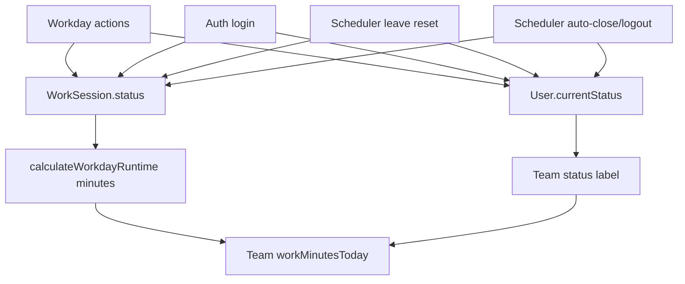

# TVA_TEAM_STATUS_AUDIT.md

Date: 2026-06-06
Mode: Read-only forensic audit

## Verdict

Team status is not driven by one source. It uses:

- `User.currentStatus` for displayed status.
- `WorkSession` and `BreakLog` through `calculateWorkdayRuntime` for minutes.
- `LeaveRequest` for on-leave state.
- Scheduler resets and auth login to mutate status.

Risk: High.

## Status Source Matrix

| Status | Primary Writer | Storage | Display Source | Notes |
| --- | --- | --- | --- | --- |
| `WORKING` | `WorkdayService.startWork`, `resumeWork`, `endBreak` | `WorkSession.status`, `User.currentStatus` | `User.currentStatus` in team API | minutes from runtime calculator |
| `ON_BREAK` | `WorkdayService.startBreak` | `WorkSession.status`, `User.currentStatus`, open `BreakLog` | `User.currentStatus` | break minutes from runtime calculator |
| `IDLE` | `WorkdayService.reportIdle` | `WorkSession.status`, `User.currentStatus` | `User.currentStatus` | frontend hook exists but no runtime consumer found |
| `LOGGED_IN` | `AuthService.login` | `WorkSession.status`, `User.currentStatus` | `User.currentStatus` | login does not start work but creates session |
| `LOGGED_OUT` | `WorkdayService.endWork`, scheduler auto-close/auto-logout | `WorkSession.status`, `User.currentStatus` | `User.currentStatus` | may be manual or scheduler |
| `ON_LEAVE` | scheduler leave setter | `WorkSession.status`, `User.currentStatus`, `leaveId` | `User.currentStatus` plus leave request | midnight cron |
| `OFFLINE` | scheduler leave reset, auth initial/no session | `User.currentStatus` | `User.currentStatus` | may not imply no work session |

## Flow

## Consumers

| Consumer | File | Source |
| --- | --- | --- |
| Team page | `frontend/app/(dashboard)/(operations)/team/page.tsx` | `/workday/team` |
| Topbar status | `frontend/components/layout/topbar.tsx` | `/workday/today` |
| Sidebar status | `frontend/components/layout/sidebar.tsx` | `/workday/today` |
| QuickActionDock | `frontend/components/ui/QuickActionDock.tsx` | auth store `user.currentStatus` |
| TeamPressurePanel | `frontend/components/home/TeamPressurePanel.tsx` | home summary/team pressure data |
| Dashboard active today | `backend/src/modules/platform/dashboard/dashboard.service.ts` | `User.currentStatus` count |

## Conflicts

### TVA-TS-001: Status and Minutes Use Different Authorities

`WorkdayService.getTeam` returns `workStatus: m.currentStatus`, while `workMinutesToday` comes from `calculateWorkdayRuntime`.

Severity: High.

### TVA-TS-002: Login Creates `LOGGED_IN` WorkSession

Login does not start work, but it does create or update today's `WorkSession` and `User.currentStatus`.

Severity: Critical coupling.

### TVA-TS-003: Scheduler Can Set Users Offline

`setLeaveStatuses` resets all non-leave users to `OFFLINE` at midnight. `autoLogoutInactive` also sets idle users offline and updates sessions.

Severity: High.

### TVA-TS-004: QuickActionDock Uses Stale Auth User Status

The dock reads `(user as any)?.currentStatus`, not live `/workday/today`.

Severity: High.

### TVA-TS-005: Browser Idle Detection Is Not a Confirmed Runtime Input

`useIdleDetection` exists, but no consumer was found. Therefore browser activity is not reliably part of current team status, despite backend `reportIdle`.

Severity: Medium.

## Answer: How Status Is Calculated

Status is not calculated from a single workday session at read time. It is mostly stored and mutated:

- workday service writes it;
- auth login writes it;
- scheduler writes it;
- team API reads `User.currentStatus`;
- minutes are calculated from sessions.

This is a TVA violation for live status integrity.

