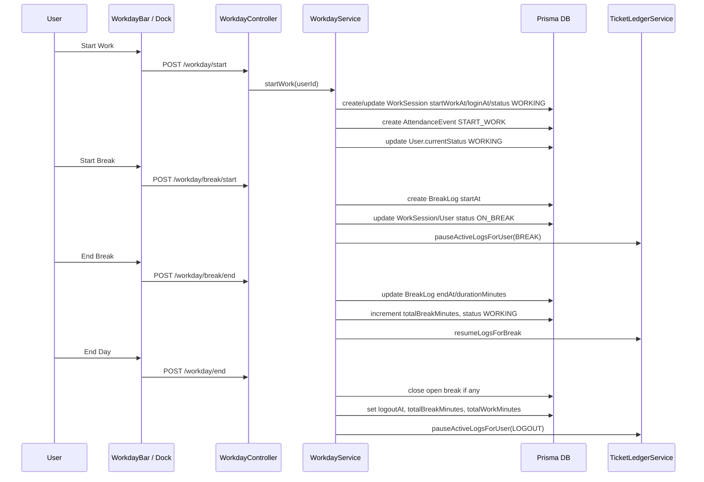
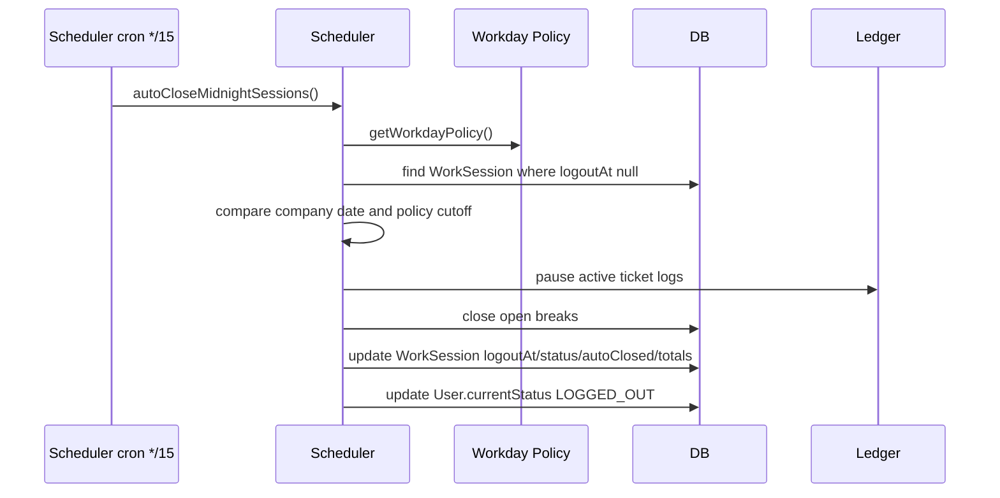
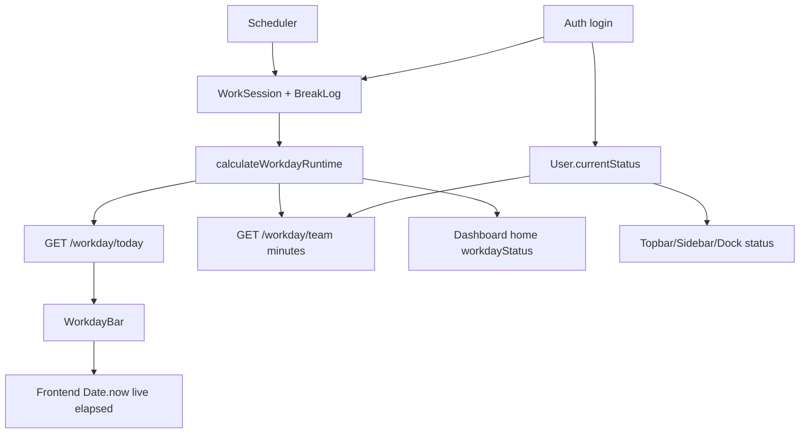

# TVA_WORKDAY_FLOW.md

Date: 2026-06-06
Mode: Read-only forensic audit

## Verdict

Workday has a partial authority: `calculateWorkdayRuntime` is the central backend calculator for current-day runtime minutes. However, Apex OS does not yet have a complete workday TVA because:

- Auth login creates/updates workday sessions.
- Scheduler writes workday status and logout timestamps.
- `User.currentStatus` is a parallel state source.
- Workday history uses stored totals, not always the runtime calculator.
- WorkdayBar and EndDayModal calculate official-looking work minutes in the frontend.
- Production historical data contains many impossible or suspicious workday rows.

Risk: Critical until frontend and scheduler calculations are subordinated to a single backend workday authority.

## Direct Answers

1. What table stores workday state?

`WorkSession` stores session state and time fields. `User.currentStatus` stores a denormalized live status. `BreakLog` stores break state. `AttendanceEvent` stores events.

2. What fields store workday timing?

`WorkSession.date`, `loginAt`, `startWorkAt`, `logoutAt`, `totalBreakMinutes`, `totalIdleMinutes`, `totalWorkMinutes`, `autoClosedAt`; `BreakLog.startAt`, `endAt`, `durationMinutes`.

3. How is worked time calculated?

For current-day live API flows, `calculateWorkdayRuntime` calculates elapsed work minutes from sessions/breaks. On manual end and scheduler auto-close, totals are stored using local service calculations.

4. Is worked time stored or derived?

Both. `totalWorkMinutes` is stored at close; active sessions are derived by `calculateWorkdayRuntime`; frontend WorkdayBar derives again for display.

5. Is break time stored or derived?

Both. `BreakLog.durationMinutes` and `WorkSession.totalBreakMinutes` are stored; open breaks are derived in runtime calculation.

6. Is dashboard using the same calculation?

Partially yes. `DashboardService.getWorkdayStatus` uses `calculateWorkdayRuntime`.

7. Is analytics using the same calculation?

No dedicated workday analytics were found in analytics service. Analytics primarily uses ticket time logs, not workday runtime.

8. Is team status using the same calculation?

Minutes: yes, `WorkdayService.getTeam` uses `calculateWorkdayRuntime`. Status: no, it returns `User.currentStatus`.

## Workday Lifecycle

## Auto-Close Flow

## Data Flow

## Responsible Files

| Responsibility | File |
| --- | --- |
| Workday API routes | `backend/src/modules/platform/workday/workday.controller.ts` |
| Workday writes and reads | `backend/src/modules/platform/workday/workday.service.ts` |
| Runtime calculator | `backend/src/modules/platform/workday/workday.calculation.ts` |
| Company date/timezone | `backend/src/common/utils/timezone.util.ts` |
| Policy cutoff | `backend/src/modules/platform/workday/workday.policy.helper.ts` |
| Auto-close and resets | `backend/src/modules/platform/scheduler/scheduler.service.ts` |
| Login coupling | `backend/src/modules/core/auth/auth.service.ts` |
| Workday display | `frontend/components/workday/WorkdayBar.tsx` |
| End-day display | `frontend/components/workday/EndDayModal.tsx` |
| Team status display | `frontend/app/(dashboard)/(operations)/team/page.tsx` |
| Quick actions | `frontend/components/ui/QuickActionDock.tsx` |

## Violations

| ID | Violation | Severity |
| --- | --- | --- |
| TVA-WD-001 | `WorkdayBar` adds client-side elapsed delta to backend `elapsedWorkMinutes`, which can double count active time because backend already includes live elapsed for open sessions. | Critical |
| TVA-WD-002 | `EndDayModal` calculates work minutes locally from `startWorkAt` and stored break minutes. | High |
| TVA-WD-003 | Team status combines `User.currentStatus` with `WorkSession`-derived minutes. | High |
| TVA-WD-004 | Auth login creates/updates `WorkSession` and `User.currentStatus`. | Critical |
| TVA-WD-005 | Scheduler auto-logout can set `logoutAt` based on idle/auth-like status. | Critical |
| TVA-WD-006 | Workday history summarizes stored totals, while current screens use runtime calculation. | High |

